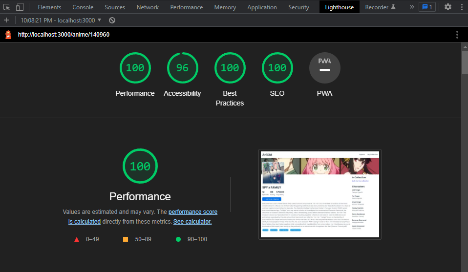

# AniList Collection

This is anime collection web app using [AniList](https://anilist.gitbook.io/anilist-apiv2-docs/) GraphQL API

Features:

- Anime list page
  - Bulk add to collection
- Anime detail page
  - Add to collection
  - In collection list
- Collection list page
  - Add, edit, remove collection
- Collection detail page
  - Edit collection
  - Remove anime from collection

## Preview

Live Site URL: [https://anilist-collection.vercel.app/](https://anilist-collection.vercel.app/)

## Getting Started

First, run the development server:

```bash
npm run dev
# or
yarn dev
```

Open [http://localhost:3000](http://localhost:3000) with your browser to see the result.

## Built with

- Framework: NextJs, React (Context API, Hooks)
- Css Library: Emotion, Geist UI
- Fetching Library: Apollo Client
- WebStorage API

## Lighthouse



## Author

- Website - [Fauzan Rianda](https://fauzanr.github.io)
- Linkedin - [Fauzan Rianda](https://www.linkedin.com/in/fauzanr/)
  .
